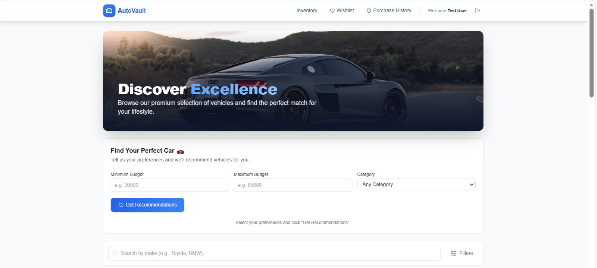
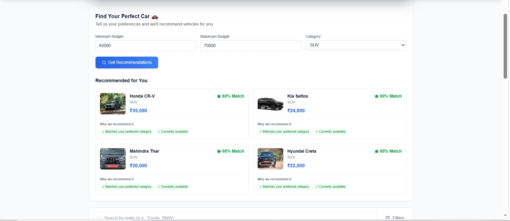
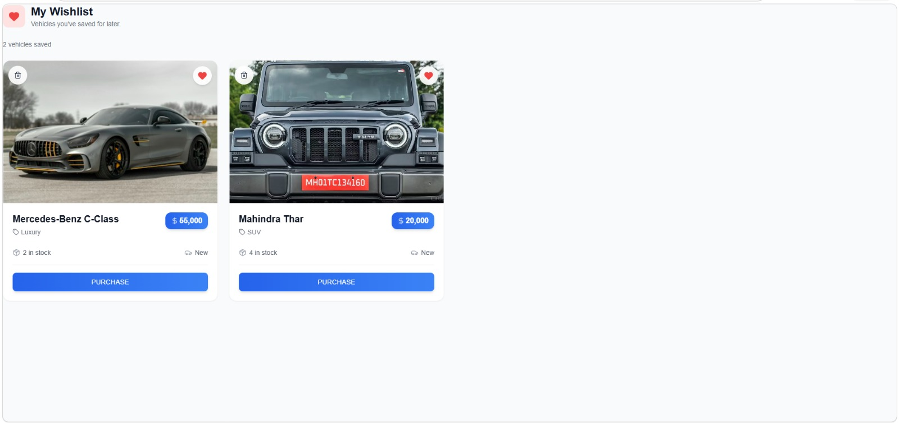
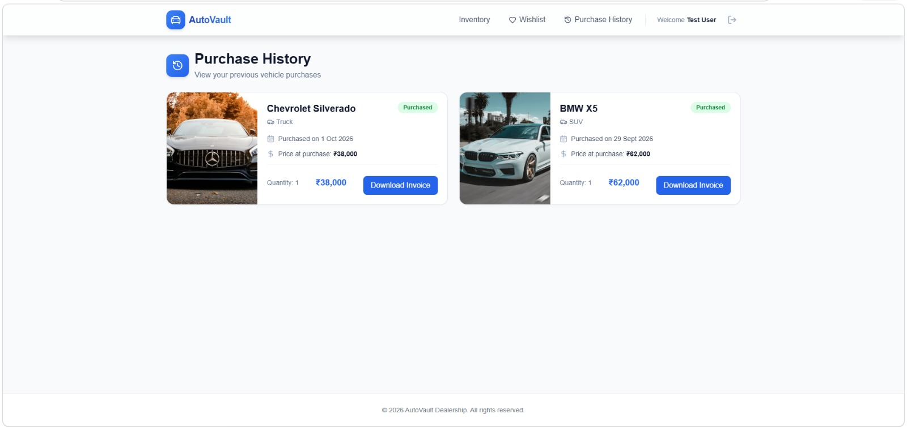
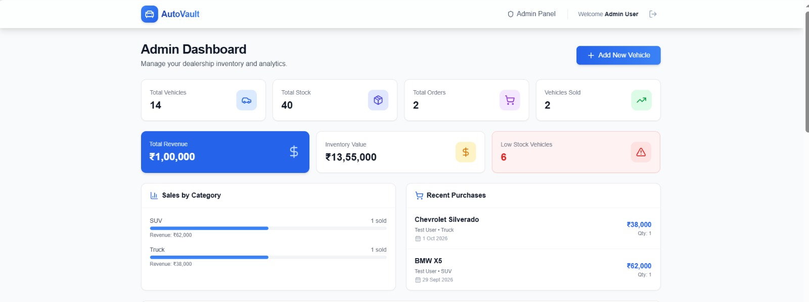
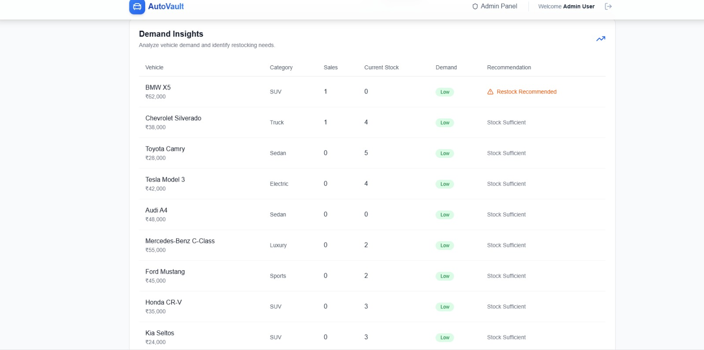

# AutoVault - Car Dealership Inventory System

AutoVault is a full-stack car dealership inventory management system designed to manage vehicle inventory, purchases, users, and dealership operations through a role-based web application.

The application provides separate workflows for customers and administrators, including vehicle browsing, purchasing, wishlist management, purchase history, inventory management, analytics, demand insights, and invoice generation.

**Tech Stack:** React.js • Node.js • Express.js • PostgreSQL • Prisma • JWT • Zod

---

## 🚀 Features

### 👤 User Features

- User registration and login
- JWT-based authentication
- Browse available vehicles
- Search and filter vehicles
- View vehicle details and availability
- Purchase vehicles
- Automatic stock updates after purchases
- Purchase history
- Invoice generation
- Wishlist management
- Rule-based vehicle recommendations

### 🛡️ Admin Features

- Role-based access control
- Admin-only dashboard
- Add new vehicles
- Update vehicle information
- Delete vehicles
- Restock inventory
- Inventory pagination
- Inventory sorting
- Low-stock identification
- Sales analytics
- Revenue tracking
- Category-wise sales insights
- Recent purchase tracking
- Inventory demand insights

### 📊 Inventory & Business Logic

- Automatic stock updates after purchases
- Stock validation before purchase
- Low-stock detection
- Inventory value calculation
- Sales and revenue analytics
- Demand classification based on sales history
- Restock recommendations
- Purchase price snapshot using `priceAtPurchase`

### ❤️ Wishlist

- Add vehicles to wishlist
- Remove vehicles from wishlist
- Persistent wishlist for authenticated users
- User-specific wishlist data

### 🎯 Recommendation System

AutoVault includes a lightweight rule-based recommendation system.

Vehicles are ranked using factors such as:

- Category preference
- Budget range
- Vehicle availability

The system assigns a recommendation score and returns the highest-ranked vehicles.

> This is a rule-based recommendation system and does not use machine learning.

---

## 🛠️ Tech Stack

### Frontend

- React.js
- Vite
- React Router
- Tailwind CSS
- Axios
- Lucide React
- Vitest
- React Testing Library

### Backend

- Node.js
- Express.js
- JavaScript
- JWT
- bcrypt
- Zod
- Jest
- Supertest

### Database

- PostgreSQL
- Prisma ORM

### Development & Testing

- Git & GitHub
- Postman
- Jest / Supertest
- Vitest / React Testing Library

---


## 📸 Screenshots

### User Dashboard



### Vehicle Recommendations



### Wishlist



### Purchase History



### Admin Dashboard & Analytics



### Demand Insights



---

## 🏗️ Application Architecture

```text
                    ┌─────────────────────┐
                    │    React + Vite     │
                    │      Frontend       │
                    └──────────┬──────────┘
                               │
                             Axios
                               │
                               ▼
                    ┌─────────────────────┐
                    │   Node.js + Express │
                    │       Backend       │
                    └──────────┬──────────┘
                               │
                         Prisma ORM
                               │
                               ▼
                    ┌─────────────────────┐
                    │     PostgreSQL      │
                    │      Database       │
                    └─────────────────────┘

                    JWT Authentication
                    Role-Based Access
                       USER / ADMIN
```

---

## 🔐 Authentication & Authorization

AutoVault uses JWT-based authentication and role-based access control.

### User Role

Authenticated users can:

- Browse vehicles
- Purchase vehicles
- Manage wishlist
- View purchase history
- Download invoices
- Get vehicle recommendations

### Admin Role

Administrators can additionally:

- Access the admin dashboard
- Create vehicles
- Update vehicles
- Delete vehicles
- Restock inventory
- View analytics
- View demand insights

Protected backend routes use authentication and authorization middleware to ensure that users can only access permitted operations.

---

## 🚗 Core Purchase Flow

When a user purchases a vehicle:

```text
User selects vehicle
        ↓
Authentication check
        ↓
Stock availability validation
        ↓
Purchase created
        ↓
Stock quantity updated
        ↓
Purchase history updated
        ↓
Invoice becomes available
        ↓
Analytics are updated
```

The purchase stores the vehicle price at the time of purchase using `priceAtPurchase`, allowing historical purchase records to remain accurate even if the vehicle's current price changes later.

---

## 📦 Database Design

AutoVault uses PostgreSQL with Prisma ORM.

### Main Entities

```text
User
 │
 │ 1:N
 ▼
Purchase
 │
 │ N:1
 ▼
Vehicle
```

### Relationships

- One user can have multiple purchases.
- One vehicle can appear in multiple purchase records.
- Each purchase belongs to one user and one vehicle.

### User

Stores:

- User information
- Email
- Password hash
- Role
- Timestamps

### Vehicle

Stores:

- Make
- Model
- Category
- Price
- Quantity
- Image URL
- Timestamps

### Purchase

Stores:

- User
- Vehicle
- Quantity
- Purchase price
- Total amount
- Purchase date

---

## 📈 Admin Analytics

The admin dashboard provides operational insights including:

- Total vehicles
- Total stock
- Total orders
- Vehicles sold
- Total revenue
- Inventory value
- Low-stock vehicles
- Sales by category
- Recent purchases

### Demand Insights

Vehicles are classified based on their sales history:

```text
Sales >= 5  → High Demand
Sales >= 2  → Medium Demand
Otherwise   → Low Demand
```

The system also identifies vehicles that may require restocking based on available quantity and previous sales.

---

## 🔎 Search, Filtering & Pagination

The inventory system supports:

- Vehicle search
- Category filtering
- Price-based filtering
- Availability filtering
- Pagination
- Sorting by selected inventory fields
- Ascending / descending sorting

Pagination is handled on the backend using Prisma's `skip` and `take` operations.

---

## 🧪 Testing

AutoVault includes automated tests for both frontend and backend functionality.

### Backend

- Jest
- Supertest
- API route testing
- Authentication testing
- Authorization testing
- Vehicle operations
- Purchase flows
- Inventory operations

### Frontend

- Vitest
- React Testing Library
- Component testing

### Test Results

```text
Backend Tests   → 75 / 75 passed
Frontend Tests  →  5 /  5 passed
----------------------------------
Total           → 80 / 80 passed
```

Production builds were also successfully verified for both frontend and backend.

---

## 📁 Project Structure

```text
AutoVault/
│
├── client/
│   ├── src/
│   │   ├── components/
│   │   ├── pages/
│   │   ├── context/
│   │   ├── services/
│   │   └── ...
│   └── package.json
│
├── server/
│   ├── src/
│   │   ├── controllers/
│   │   ├── middleware/
│   │   ├── modules/
│   │   ├── routes/
│   │   ├── services/
│   │   └── ...
│   ├── prisma/
│   │   ├── schema.prisma
│   │   └── seed.js
│   └── package.json
│
├── README.md
├── TEST_REPORT.md
├── PROMPTS.md
└── .gitignore
```

---

## ⚙️ Getting Started

### Prerequisites

Make sure the following are installed:

- Node.js
- npm
- PostgreSQL
- Git

### 1. Clone the repository

```bash
git clone https://github.com/Narmata29/AutoVault.git
cd AutoVault
```

### 2. Install backend dependencies

```bash
cd server
npm install
```

### 3. Configure backend environment variables

Create a `.env` file inside the `server` directory.

```env
DATABASE_URL="your_postgresql_connection_string"
JWT_SECRET="your_jwt_secret"
PORT=5000
```

### 4. Setup the database

```bash
npx prisma migrate dev
```

Generate Prisma Client:

```bash
npx prisma generate
```

### 5. Seed sample data

```bash
npm run seed
```

### 6. Start the backend

```bash
npm run dev
```

The backend runs on:

```text
http://localhost:5000
```

### 7. Start the frontend

Open another terminal:

```bash
cd client
npm install
npm run dev
```

The frontend runs on:

```text
http://localhost:5173
```

---

## 🧪 Running Tests

### Backend

```bash
cd server
npm test
```

### Frontend

```bash
cd client
npm test
```

---

## 🔒 Security

The project follows basic application security practices including:

- Password hashing using bcrypt
- JWT-based authentication
- Role-based authorization
- Request validation using Zod
- Environment variables for secrets
- Protected API routes
- Server-side stock validation

Sensitive credentials and environment variables are not committed to the repository.

---

## 🔮 Future Enhancements

Potential future improvements include:

- Payment gateway integration
- Advanced sales forecasting
- Email notifications
- Cloud deployment
- Vehicle image upload/storage
- Advanced reporting and export
- More sophisticated recommendation algorithms
- Customer reviews and ratings

---

## 📌 Project Highlights

AutoVault demonstrates practical implementation of:

- Full-stack JavaScript development
- REST API design
- Authentication & authorization
- PostgreSQL database design
- Prisma ORM
- Role-based access control
- Inventory management
- Purchase and inventory business logic
- Analytics
- Automated testing
- API validation
- Frontend state management
- Pagination and sorting
- Rule-based recommendations

---

## 👩‍💻 Author

**Narmata Thakral**

GitHub: [Narmata29](https://github.com/Narmata29)